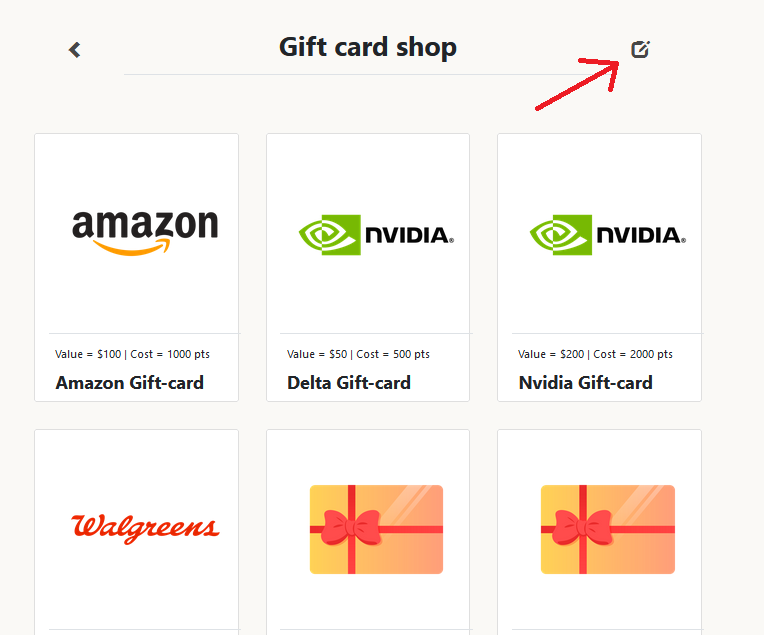

# AirAsia Website Project

_Created for IS6465 at the University of Utah_

# VERSION INFO
1. Php dev version: 8.0
2. CLI = 8.1.0
3. Bootstrap versions 3.7, 4.1

# DB INFO
To create the database run the SQL files in this order:

1. sqlUsers.sql
2. sqlCard.sql
3. phpImage.php
4. sqlCart.sql
5. sqlRedemption.sql

After that some database tables can be reset from the admin page which can be accessed when logged in as the admin user.

# LOGIN INFO
There are four default users with [username - password - role]
1. admin - admin - admin
2. msis@utah.edu - root - user
3. bsmith - mysecret - admin
4. pjones - acrobat - user

Passwords are stored in hashes, so they can't simply be read or updated directly in the database.

# MISC INFO
Card updates and editing can be accessed from the edit glyphicon on the cardlist and carddetail pages. As shown below

# REQUIREMENTS
1. Log in to the system and show the list of gift cards (5 pt). Use password_verify to validate the password.

_Done, The cards can be accessed from the side menu_

2. Add session management to the system (5 pt). This means users cannot access any page (except login.php) unless they are logged in. Log the user out of the system.

_Done all pages need logins or privileges except for flights, index and login_

3. Add authorization to control user access to pages (5 pt).

_Done user cannot edit cards or add new cards or go to the admin panel_

4. Add a new customer (cust-add.php) (5 pt). Customer is synonymous with User. Use password_hash to hash the password and insert it into the USER DB table.

_Done But users create own account and are referred to as users._

5. Add the new USER database table. Connect the PHP page to DB. (5 pt)

_Done_

6. Add pages to allow users to redeem gift cards. (Extra credit 5 pts). The use case must deduct points from the user account and insert a new row into the Redemption table.

_Done this can be done in the shopping cart_

7. Organize your code in respective folders if needed.

_Done_

8. Use the default usernames and passwords for testing your application

_Done_
